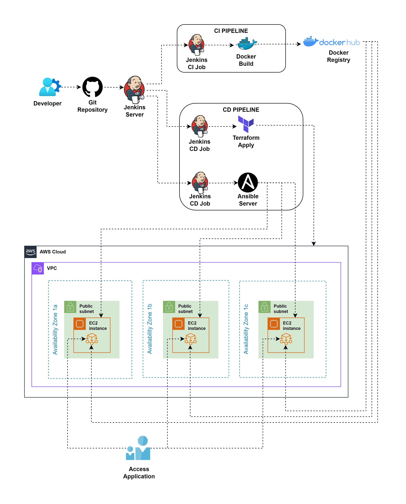

# Flask Web Application Deployment on AWS Using Terraform, Ansible, Jenkins, and Docker

## Project Overview
This project demonstrates the deployment of a simple Flask web application on AWS using Terraform, Ansible, Jenkins CI/CD pipeline, and Docker. The infrastructure is provisioned using Terraform, while Ansible manages the configuration of EC2 instances. Jenkins automates the deployment process, ensuring an efficient and reliable workflow. The Flask app is containerized and runs inside Docker on EC2 instances.

## CI/CD Pipeline Architecture Diagram

## Architecture Components
- VPC: A Virtual Private Cloud (VPC) with public subnets for hosting EC2 instances.
- Subnets: Public subnets are provisioned for EC2 instances to host the Flask application.
- Internet Gateway: Allows internet access for the EC2 instances in public subnets.
- EC2 Instances: AWS EC2 instances to run the Dockerized Flask app.
- Security Groups: Firewall rules allowing access on HTTP (port 80), SSH (port 22), and Flask (port 5000).
- Key Pair: Used to securely connect to the EC2 instances.
- Dynamic Inventory: AWS dynamic inventory used by Ansible for targeting EC2 instances during playbook execution

## Tools and Technologies
- **Terraform**: Used for provisioning AWS infrastructure, including VPC, subnets, security groups, and EC2 instances.
- **Ansible**: Manages the configuration of EC2 instances, installs Docker, and runs the Flask application as a Docker container. Ansible is also configured to use AWS dynamic inventory to fetch instance information dynamically.
- **Jenkins**: Automates the deployment process by orchestrating Terraform and Ansible workflows.
- **Docker**: Flask application is containerized and runs inside Docker on EC2 instances.

## CI/CD Pipeline
### Jenkins:
- Automates the deployment process.
- Fetches the code from the repository.
- Runs Terraform to provision AWS infrastructure.
- Copies the necessary files to the Ansible server.
- Triggers the execution of Ansible playbooks.

### Ansible:
- Configures EC2 instances by installing Docker.
- Deploys the Dockerized Flask app on the EC2 instances using AWS dynamic inventory to retrieve EC2 instance details.

### Docker:
- Flask application is containerized and runs inside Docker on EC2 instances.

### Terraform:
- Provisions AWS infrastructure such as VPC, subnets, security groups, and EC2 instances.
- Managed and executed from the Jenkins server as part of the pipeline.

## Key Highlights
- **Fully Automated**: End-to-end automation from code commit to application deployment using Jenkins, Ansible, and Docker.
- **Infrastructure-as-Code**: Terraform is used to define, manage, and provision all infrastructure components on AWS.
- **Containerization**: The Flask app is containerized using Docker, ensuring consistency across environments.
- **Separate Servers for CI/CD**: Jenkins and Ansible run on separate servers to ensure better management and separation of concerns.
- **Dynamic Inventory**: Ansible dynamically retrieves EC2 instance details from AWS, ensuring up-to-date configuration of the infrastructure.
- **Scalability**: Infrastructure can be easily scaled by modifying the Terraform configuration.

## Deployment Workflow
1. **Infrastructure Provisioning**: Jenkins triggers Terraform to provision the AWS infrastructure (VPC, subnets, security groups, and EC2 instances).
2. **Configuration Management**: Jenkins copies the necessary files to the Ansible server, which then installs Docker on the provisioned EC2 instances.
3. **Application Deployment**: Ansible runs a playbook to deploy the Flask app as a Docker container on the EC2 instances.

## Future Improvements
- Auto-Scaling: Implement auto-scaling for the EC2 instances based on load.
- Monitoring: Integrate monitoring and logging tools like Prometheus and Grafana to gain insights into application performance.
- Database Integration: Connect the Flask app to an RDS database.
- Kubernetes: Migrate to Kubernetes for container orchestration and scaling.

## Contributing

Contributions are welcome! Please open an issue or submit a pull request for any improvements or suggestions. 

## License

This project is licensed under the MIT License. You can find more details in the [LICENSE](./LICENSE) file.
